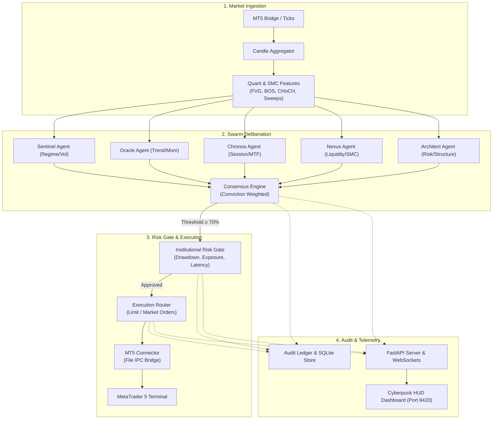

<div align="center">

# ⚡ CYBER SWARM TRADING OS ⚡

**AI-Native Autonomous Trading Operating System & Swarm Command Center**

[](https://github.com/HackWarrior/cyber-swarm/actions/workflows/ci.yml)
[](https://www.python.org/)
[](LICENSE)
[](tests/)
[](https://fastapi.tiangolo.com)
[](mt5/)

</div>

---

## 🌐 Overview

**CYBER SWARM TRADING OS** is an institutional-grade, multi-agent autonomous algorithmic trading platform. Inspired by decentralized swarm intelligence and dark cyberpunk telemetry interfaces, it transforms quantitative SMC (Smart Money Concepts) signals into fully auditable, risk-bounded trade executions via a MetaTrader 5 (MT5) bridge.

Every trade decision passes through a deterministic pipeline:
```text
OBSERVE → UNDERSTAND → DEBATE → CONSENSUS → RISK GATE → EXECUTE → VERIFY → AUDIT
```

---

## 🏛️ System Architecture



---

## ✨ Key Features

### 1. Multi-Agent Swarm Intelligence
- **Sentinel**: Monitors market volatility, regime classification, and anomalous spreads.
- **Oracle**: Multi-period trend momentum and directional bias.
- **Chronos**: Session timing (London, New York, Asia overlaps) and multi-timeframe alignment.
- **Nexus**: Order flow, liquidity sweeps, and Smart Money Concepts (FVG, Order Blocks).
- **Architect**: Structural integrity and portfolio exposure boundaries.

### 2. Consensus Engine
- Dynamic conviction aggregation with strict conviction thresholds:
  - `< 55%`: **HOLD** (Fail closed)
  - `55% - 70%`: **WATCH**
  - `70% - 80%`: **SIGNAL**
  - `80% - 90%`: **HIGH CONVICTION**
  - `> 90%`: **EXTREME CONSENSUS**

### 3. Institutional Risk Gate
- **Hard Daily Drawdown Cap**: Auto-killswitch at configurable threshold (default: 5.0%).
- **Per-Trade Risk Cap**: Max risk per single position (default: 10.0%).
- **Max Portfolio Exposure**: Capped aggregated leverage (default: 40.0%).
- **Max Open Positions**: Hard limit on concurrent active positions.
- **Stale Data Protection**: Fail-closed safe mode if tick latency exceeds 2,000 ms.

### 4. Advanced Execution Engines
- **Dynamic Trailing Stop Ratchet**: Automated milestone ratcheting per instrument (XAUUSD, BTCUSD, EURUSD, USOIL).
- **Auto Take-Profit Engine**: Granular multi-point targets (100 - 300 points) with point-size calibration.
- **Network Reconnection & Order Reconciliation**: Automatic state synchronization upon network reconnection, filtering stale pending orders by TTL and price drift.

### 5. Auditability & Telemetry
- Complete SQLite persistent audit ledger (`audit_store.db`).
- Every lifecycle event is tagged with end-to-end correlation IDs:
  `event_id` → `signal_id` → `consensus_id` → `risk_id` → `order_id` → `broker_ticket`.
- Real-time WebSocket telemetry streamed to a cyberpunk HUD dashboard.

---

## 📁 Repository Structure

```text
cyber_swarm/
├── agents/                 # Specialized Swarm Agent Implementations
│   ├── base_agent.py       # Base agent class and signal protocol
│   └── specialized_agents.py # Sentinel, Oracle, Chronos, Nexus, Architect
├── audit/                  # Institutional Audit & Persistence
│   ├── ledger.py           # In-memory fast audit ledger & event bus
│   └── persistence.py      # SQLite historical persistence store
├── consensus/              # Swarm Consensus Engine
│   └── consensus_engine.py # Weighted voting and conviction calculation
├── core/                   # System Foundations
│   ├── aicl.py             # Agent Inter-Communication Language (AICL)
│   ├── config.py           # Pydantic global system configuration
│   ├── event_bus.py        # Asynchronous decoupled event bus
│   └── models.py           # Data models (Ticks, Signals, Orders, Consensus)
├── execution/              # Order Execution & Routing
│   ├── mt5_connector.py    # MetaTrader 5 IPC file connector
│   └── router.py           # Order execution router & paper simulation
├── mt5/                    # MetaTrader 5 Expert Advisor
│   └── CyberSwarmBridge.mq5 # MQL5 Bridge EA
├── quant/                  # Quantitative Analysis & SMC
│   ├── candle_aggregator.py# Multi-timeframe bar/candle aggregator
│   └── features.py         # ATR, Swing Fractals, FVG, BOS, CHoCH, Sweeps
├── risk/                   # Institutional Safety
│   └── risk_gate.py        # Institutional pre-trade risk validation gate
├── server/                 # FastAPI Telemetry Backend & Web HUD
│   ├── app.py              # FastAPI server & WebSocket broadcast
│   └── static/             # Dark Cyberpunk HUD Dashboard
│       └── index.html      # Glassmorphism HTML5/Canvas UI
├── simulation/             # Backtesting & Historical Replay
│   └── backtest_engine.py  # Simulation engine
├── tests/                  # Pytest Test Suite (58 tests)
├── .env.example            # Environment variables template
├── .gitignore              # Production gitignore
├── LICENSE                 # MIT License
├── pyproject.toml          # Modern packaging configuration
└── requirements.txt        # Runtime and test dependencies
```

---

## 🚀 Quick Start

### 1. Prerequisites
- **Python 3.11 or 3.12**
- **Git**
- *(Optional for Live Execution)*: **MetaTrader 5 Terminal** with Windows OS.

### 2. Installation
Clone the repository and install dependencies:
```bash
git clone https://github.com/HackWarrior/cyber-swarm.git
cd cyber-swarm

# Create virtual environment
python -m venv .venv

# Activate virtual environment
# Windows:
.venv\Scripts\activate
# Linux/macOS:
source .venv/bin/activate

# Install dependencies
pip install -r requirements.txt
```

### 3. Configure Environment
Copy the example environment file:
```bash
cp .env.example .env
```

### 4. Run Tests
Ensure all 58 unit and integration tests pass:
```bash
pytest tests/ -v
```

### 5. Launch Telemetry Server & Cyberpunk Dashboard
Start the FastAPI server:
```bash
python -m uvicorn cyber_swarm.server.app:app --host 0.0.0.0 --port 8420 --reload
```
Open your browser and navigate to:
```text
http://localhost:8420
```

---

## 📈 Supported Instruments

| Symbol | Description | Point Size Definition | Default Trailing Activation |
|---|---|---|---|
| `XAUUSD` | Gold Spot / US Dollar | `0.01` ($1.00 per 100 pt) | $4.00 delta |
| `BTCUSD` | Bitcoin / US Dollar | `1.00` ($100.00 per 100 pt) | $100.00 delta |
| `EURUSD` | Euro / US Dollar | `0.00001` (10 pips per 100 pt) | 0.0006 delta |
| `USOIL` | Crude Oil WTI / USD | `0.01` ($1.00 per 100 pt) | $0.30 delta |

---

## 🔌 MetaTrader 5 Bridge Setup

1. Copy [`mt5/CyberSwarmBridge.mq5`](mt5/CyberSwarmBridge.mq5) to your MT5 terminal data folder:
   `MQL5/Experts/CyberSwarmBridge.mq5`
2. Compile the EA in MetaEditor.
3. Attach `CyberSwarmBridge` to any chart on MT5 and enable **Allow Algo Trading**.
4. Configure the file path in `core/config.py` or `.env` to point to MT5's Common Files directory.

---

## 🛡️ Risk & Safety Disclaimer

> **IMPORTANT DISCLAIMER**: This software is built for educational, research, and algorithmic trading architecture development. Automated trading involves substantial risk of capital loss. Never trade with money you cannot afford to lose. Past performance does not guarantee future results. The authors and contributors assume no responsibility for financial losses incurred.

---

## 📄 License

This project is licensed under the [MIT License](LICENSE).
